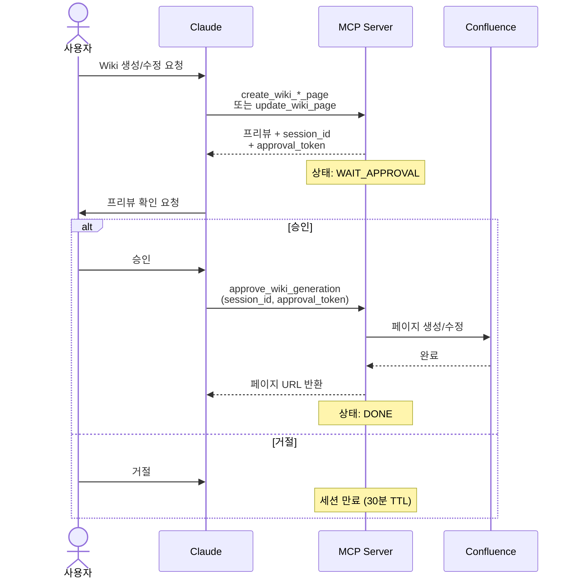
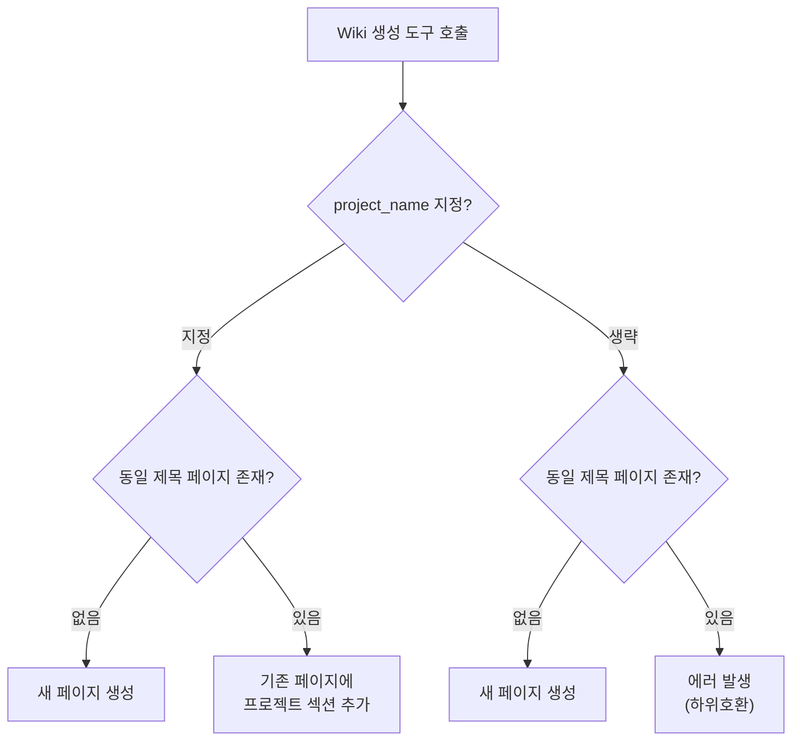
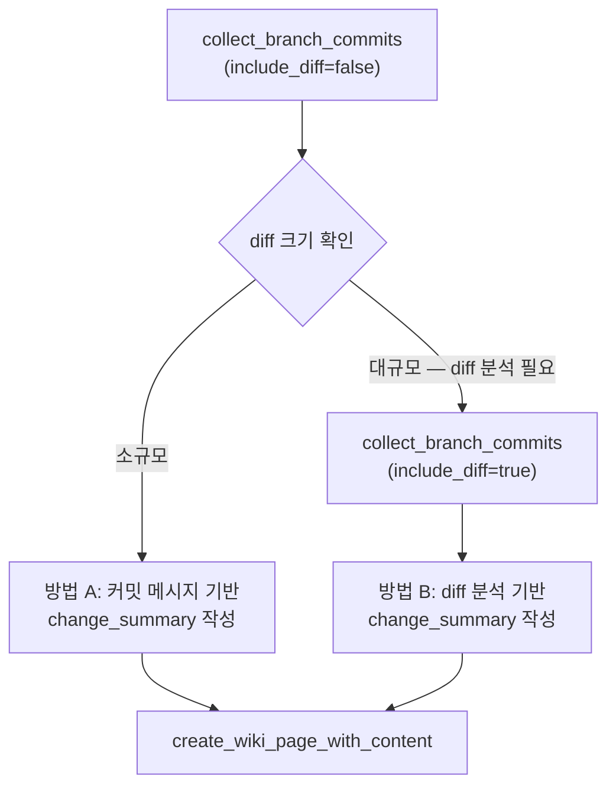
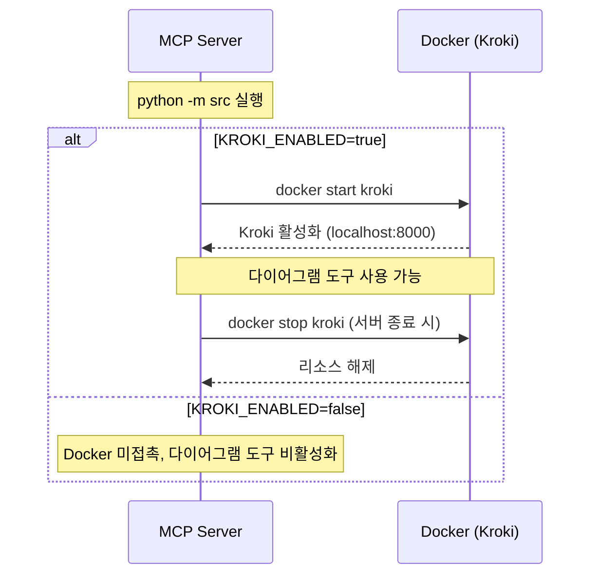
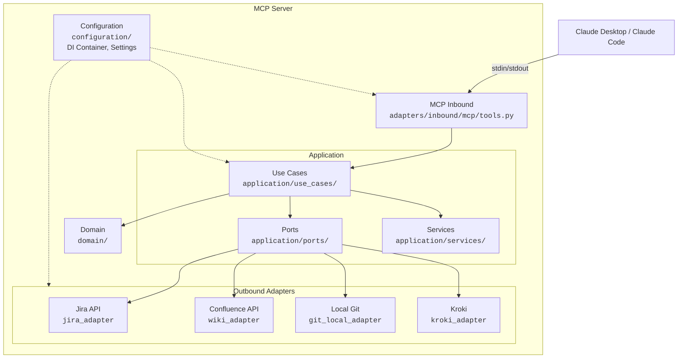

# auto-mcp-server

Claude Desktop / Claude Code 등 에이전트에서 사용할 수 있는 로컬 MCP(Model Context Protocol) 서버입니다.

**제공 기능:**
- Jira 이슈 조회/관리 (조회, 상태 전환, 완료 처리, 필터 생성)
- Wiki 페이지 자동 생성 (Jira 이슈 정리, 브랜치 커밋 기록, 자유 형식 커스텀 페이지, 멀티프로젝트 병합)
- Wiki 페이지 조회/수정 (페이지 ID 또는 제목으로 조회, 내용 추가/삭제/수정)
- Git 브랜치 커밋 수집 및 변경사항 분석 (베이스 브랜치 자동 탐지, 스마트 Diff 필터링)
- 프로젝트별 Jira 설정 외부화 (`JIRA_PROJECT_CONFIGS` 환경변수로 종료일 필드, Wiki 날짜 기준, 커스텀 필드, 상태 목록을 선언적으로 구성)
- 다이어그램 생성 및 Wiki 첨부 (Mermaid, PlantUML, C4 등 15종 — Kroki + Docker 기반, 선택 기능)

---

## 목차

1. [세팅 가이드](#-세팅-가이드)
   - [환경 변수 설정](#1-환경-변수-설정)
   - [가상환경 생성](#2-가상환경-생성)
   - [MCP 추가](#3-mcp-추가)
   - [Ignore 세팅](#4-ignore-세팅)
2. [제공 기능](#-제공-기능)
   - [Jira 기능](#1-jira-기능)
   - [Wiki 생성/조회/수정 기능](#2-wiki-생성조회수정-기능)
   - [Git 커밋 수집 및 분석](#3-git-커밋-수집-및-분석)
   - [다이어그램 기능](#4-다이어그램-기능-선택)
3. [사용 예시](#-사용-예시)
4. [문제 해결](#-문제-해결)
5. [추가 정보](#-추가-정보)

---

## 🛠 세팅 가이드

### 사전 요구사항

- **macOS**
- **Python 3.11 이상**
- **Git CLI** (macOS 기본 설치, 확인: `git --version`)
- **Docker Desktop** (선택 — 다이어그램 기능 사용 시 필요, 확인: `docker --version`)

### 1. 환경 변수 설정

`.env.local.example` 파일을 복사하여 `.env.local` 파일을 생성합니다.

```bash
cp .env.local.example .env.local
```

생성된 `.env.local` 파일을 열어 본인 환경에 맞게 수정합니다.

```bash
vi .env.local  # 또는 원하는 에디터 사용
```

#### 환경 변수 설명

**필수 설정:**

| 변수 | 설명 | 예시 |
|------|------|------|
| `APP_ENV` | 환경 구분. `.env.{값}` 파일을 로드 | `local` |
| `SERVER_NAME` | MCP 서버 이름 | `auto-mcp-server` |
| `JIRA_BASE_URL` | Jira 서버 URL (마지막 `/` 제거) | `http://jira.mycompany.com:8080` |
| `USER_ID` | Jira/Confluence 로그인 ID (Cloud: 이메일) | `your_username` |
| `USER_PASSWORD` | Jira/Confluence 비밀번호 (Cloud: API 토큰) | `your_password` |

> **Atlassian Cloud 사용 시:** `USER_PASSWORD`에 비밀번호가 아닌 **API 토큰**을 입력합니다.
> 생성: https://id.atlassian.com/manage-profile/security/api-tokens → "Create API token"

**Wiki 설정 (선택 — Wiki 기능 사용 시 필수):**

| 변수 | 설명 | 확인 방법 |
|------|------|-----------|
| `WIKI_BASE_URL` | Confluence 서버 URL | Jira와 같은 서버면 `JIRA_BASE_URL`과 동일 |
| `WIKI_ISSUE_SPACE_KEY` | Wiki 페이지를 생성할 Space Key | Confluence URL: `display/**SPACEKEY**/...` 부분 |
| `WIKI_ISSUE_ROOT_PAGE_ID` | Wiki 루트 페이지 ID | 페이지 `...` → `페이지 정보 보기` → URL의 `pageId=값` |

**추가 설정 (선택):**

| 변수 | 설명 | 기본값 |
|------|------|--------|
| `WIKI_AUTHOR_NAME` | Wiki 페이지 제목에 표시할 작성자 이름 (예: `[홍길동] 2026`) | `""` |
| `GIT_REPOSITORIES` | Git 저장소 매핑 (JSON). 브랜치 자동 탐지에 사용 | `{}` |
| `MAX_DIFF_CHARS` | `include_diff=true` 시 최대 Diff 크기 | `30000` |
| `KROKI_ENABLED` | 다이어그램 기능 사용 여부 (`true`/`false`) | `false` |
| `KROKI_URL` | Kroki 서버 URL | `http://localhost:8000` |
| `KROKI_CONTAINER_NAME` | Kroki Docker 컨테이너 이름 | `kroki` |

**`GIT_REPOSITORIES` 예시:**

```env
GIT_REPOSITORIES='{"project-a": "/프로젝트A경로", "project-b": "/프로젝트B경로"}'
```

#### 프로젝트별 Jira 설정 (`JIRA_PROJECT_CONFIGS`)

프로젝트마다 다른 Jira 동작(종료일 필드, Wiki 날짜 기준, 커스텀 필드, 상태 목록)을 환경변수로 선언적으로 구성합니다.

```env
JIRA_PROJECT_CONFIGS='[
  {
    "key": "프로젝트키",
    "due_date_field": "customfield_12345",
    "wiki_date_field": "customfield_12345",
    "jira_custom_fields": {"종료일": "customfield_12345"},
    "statuses": ["할일", "진행중", "검수대기", "완료"],
    "status_mapping": {
      "done": ["완료", "배포완료"],
      "in progress": ["진행중"],
      "to do": ["할일"],
      "pending": ["검수대기"]
    }
  },
  {
    "key": "프로젝트키2",
    "due_date_field": null,
    "wiki_date_field": "created",
    "jira_custom_fields": {},
    "statuses": ["접수", "처리중", "답변완료"],
    "status_mapping": {
      "done": ["답변완료"],
      "in progress": ["처리중"],
      "to do": ["접수"]
    }
  }
]'
```

**속성 설명:**

| 속성 | 필수 | 설명 |
|------|------|------|
| `key` | O | Jira 프로젝트 키 (이슈키 프리픽스, 예: `MYPROJECT`) |
| `due_date_field` | O | 완료 시 종료일을 기록할 Jira 필드명. `null`이면 종료일 미설정 |
| `wiki_date_field` | O | Wiki 년/월 경로에 사용할 Jira 필드명. `"created"` 등 표준 필드도 가능. 빈 문자열이면 날짜 없음 |
| `jira_custom_fields` | - | 커스텀 필드 표시명 → 필드 ID 매핑 (예: `{"종료일": "customfield_12345"}`) |
| `statuses` | - | MCP Tool 안내에 표시할 주요 상태값 목록 |
| `status_mapping` | - | 영어→한글 상태 매핑 (예: `{"done": ["완료", "배포완료"], "in progress": ["진행중"]}`). 에이전트가 영어로 상태를 입력할 때 한글로 자동 확장. `"done"` 키의 값 순서가 이슈 완료 시 상태 우선순위로도 사용됨 |

> **커스텀 필드 ID 확인 방법:**
> `GET {JIRA_BASE_URL}/rest/api/2/field` API 호출 → 응답에서 `name`/`id` 매핑 확인
> ```json
> { "id": "customfield_12345", "name": "종료일", "custom": true }
> ```

---

### 2. 가상환경 생성

#### 방법 A: Miniconda (권장)

**1) Miniconda 설치**

```bash
# Homebrew로 설치
brew install --cask miniconda

# 설치 후 conda 초기화
conda init zsh  # 또는 conda init bash
```

> 또는 [공식 사이트](https://docs.conda.io/en/latest/miniconda.html)에서 macOS 설치파일 다운로드

**2) 가상환경 생성**

```bash
conda create -n 가상환경이름 python=3.11 -y
```

**3) 가상환경의 Python 파일 위치 찾기**

```bash
conda activate 가상환경이름
which python
# 출력 예: /유저위치/miniconda3/envs/가상환경이름/bin/python
```

> 이 경로를 메모해두세요. MCP 등록 시 필요합니다.

**4) 가상환경 활성화**

```bash
conda activate 가상환경이름
```

**5) 의존성 설치**

```bash
cd /auto-mcp-server프로젝트경로/auto-mcp-server
pip install -r requirements.txt
```

---

#### 방법 B: Python venv

**1) venv 가상환경 생성**

```bash
cd /auto-mcp-server프로젝트경로/auto-mcp-server
python3.11 -m venv .venv
```

**2) 가상환경의 Python 파일 위치 찾기**

```bash
source .venv/bin/activate
which python
# 출력 예: /auto-mcp-server프로젝트경로/auto-mcp-server/.venv/bin/python
```

> 이 경로를 메모해두세요. MCP 등록 시 필요합니다.

**3) 가상환경 활성화**

```bash
source .venv/bin/activate
```

**4) 의존성 설치**

```bash
pip install -r requirements.txt
```

---

### 3. MCP 추가

#### Claude Code에서 사용

**1) 명령어로 MCP 추가**

MCP를 사용할 프로젝트의 **일반 터미널**에서 실행합니다. (Claude Code 안이 아닌, 일반 터미널에서 `claude mcp add` 명령 실행)

```bash
# MCP를 사용할 프로젝트 디렉토리에서 실행
cd /MCP를사용할프로젝트경로

claude mcp add auto-mcp-server \
  -e APP_ENV=local \
  -e PYTHONPATH=/auto-mcp-server프로젝트경로/auto-mcp-server \
  -- /유저위치/miniconda3/envs/가상환경이름/bin/python -m src
```

> venv 사용 시 Python 경로를 `/auto-mcp-server프로젝트경로/auto-mcp-server/.venv/bin/python`으로 교체하세요.

**2) 직접 설정 파일 수정**

명령어 대신 JSON 파일을 직접 편집하여 추가할 수도 있습니다.

- **글로벌 설정** (모든 프로젝트에서 사용): `~/.claude/settings.json`
- **프로젝트별 설정** (해당 프로젝트에서만 사용): `/MCP를사용할프로젝트경로/.claude/settings.local.json`

위 파일을 열고 `mcpServers` 섹션에 다음 내용을 추가합니다:

```json
{
  "mcpServers": {
    "auto-mcp-server": {
      "command": "/유저위치/miniconda3/envs/가상환경이름/bin/python",
      "args": ["-m", "src"],
      "cwd": "/auto-mcp-server프로젝트경로/auto-mcp-server",
      "env": {
        "APP_ENV": "local",
        "PYTHONPATH": "/auto-mcp-server프로젝트경로/auto-mcp-server"
      }
    }
  }
}
```

> 한글로 표시된 부분을 본인의 실제 경로로 교체하세요.

**3) 등록 확인**

```bash
claude mcp list
```

---

#### Claude Desktop에서 사용

**1) 설정 메뉴 위치**

Claude Desktop 앱 → 좌측 메뉴 → **Settings** → **Developer** → **Edit Config**

**2) 직접 설정 파일 수정**

파일 위치: `~/Library/Application Support/Claude/claude_desktop_config.json`

```json
{
  "mcpServers": {
    "auto-mcp-server": {
      "command": "/유저위치/miniconda3/envs/가상환경이름/bin/python",
      "args": ["-m", "src"],
      "cwd": "/auto-mcp-server프로젝트경로/auto-mcp-server",
      "env": {
        "APP_ENV": "local",
        "PYTHONPATH": "/auto-mcp-server프로젝트경로/auto-mcp-server"
      }
    }
  }
}
```

> 한글로 표시된 부분을 본인의 실제 경로로 교체하세요.

**3) 설정 후 Claude Desktop 재시작 필요**

---

### 4. Ignore 세팅

> 이 섹션은 MCP 서버 설정이 아닌, **Claude Code 자체의 기본 설정**에 대한 내용입니다.
> Claude Code가 프로젝트 파일을 읽을 때 민감한 파일을 제외하거나, Claude 관련 파일이 Git에 올라가지 않도록 설정하는 방법을 안내합니다.

#### .claudeignore 설정 (Claude Code가 보면 안 되는 파일)

`.claudeignore`는 **Claude Code를 실행하는 각 프로젝트에서 개별적으로 설정**합니다. (auto-mcp-server가 아닌, Claude Code로 작업하는 프로젝트에서 실행)

```bash
# claudeignore CLI 도구 설치 (최초 1회)
npm install -g claudeignore

# Claude Code를 사용하는 프로젝트에서 초기화
cd /Claude를사용할프로젝트경로
npx claude-ignore init
```

생성된 `.claudeignore` 파일에 Claude Code가 읽지 않아야 할 파일/디렉토리 패턴을 추가합니다.

예시:
```
.env.local
logs/
*.secret
```

#### .gitignore 설정 (Claude 관련 파일 Git 제외)

Claude Code를 사용하는 프로젝트의 `.gitignore`에 다음 패턴을 추가하여 Claude 관련 파일이 Git에 올라가지 않도록 합니다.

```gitignore
# Claude Code 관련
.claude/
.claudeignore
CLAUDE.md
CLAUDE-*.md
```

- Claude Code가 자동 생성하는 설정/메모리 파일이 Git 저장소에 포함되지 않도록 설정
- 팀 공유가 필요한 파일이 있는 경우 선택적으로 제외 가능

---

## 🎯 제공 기능

### MCP Tool 전체 목록

| 카테고리 | Tool | 설명 |
|---------|------|------|
| **Jira** | `get_jira_issue` | 특정 이슈 조회 (key로) |
| | `get_jira_issues` | 내 이슈 목록 조회 (상태/프로젝트 필터링) |
| | `get_jira_project_meta` | 프로젝트 이슈 유형 및 상태값 조회 |
| | `complete_jira_issue` | 이슈 완료 처리 (상태 전환 + 종료일 설정) |
| | `transition_jira_issue` | 이슈 상태 전환 (임의 상태로) |
| | `create_jira_filter` | JQL 기반 필터 생성 |
| **Wiki** | `get_wiki_page` | Wiki 페이지 조회 (페이지 ID 또는 제목으로) |
| | `update_wiki_page` | Wiki 페이지 수정 (2단계 승인 프로세스) |
| | `create_wiki_issue_page` | Jira 이슈 정리 Wiki 페이지 생성 (워크플로우 A) |
| | `create_wiki_page_with_content` | 브랜치/커밋 기반 Wiki 페이지 생성 (워크플로우 B) |
| | `create_wiki_custom_page` | 자유 형식 커스텀 Wiki 페이지 생성 (워크플로우 C) |
| | `approve_wiki_generation` | Wiki 생성/수정 승인 (실제 페이지 생성 또는 수정) |
| | `get_wiki_generation_status` | Wiki 생성 세션 상태 조회 |
| | `reload_wiki_templates` | Wiki 템플릿 핫 리로드 |
| **Git** | `collect_branch_commits` | 브랜치 커밋 수집 (Wiki 생성용) |
| | `analyze_branch_changes` | 브랜치 변경사항 분석 (범용) |
| **다이어그램** | `generate_diagram` | 다이어그램 코드를 SVG/PNG로 렌더링 (선택 기능) |
| | `attach_diagram_to_wiki` | 다이어그램을 렌더링하여 Wiki 페이지에 첨부 (선택 기능) |

#### Context 사용량

MCP 서버 연결 시 18개 Tool 정의(description + inputSchema)가 에이전트의 context에 로드됩니다.

| 항목 | 토큰 수 |
|---|---|
| Tool description | ~1,700 |
| inputSchema (파라미터 정의) | ~5,500 |
| **합계** | **~7,200** |

200k context 기준 약 **3.6%** 소모. 도구를 호출하지 않아도 연결만으로 이 만큼 사용됩니다.

---

### 1. Jira 기능

#### 1.1 특정 이슈 조회 (`get_jira_issue`)

```
Claude에게: "MYPROJECT-2365 이슈 상세정보 알려줘"
```

**파라미터:**
- `key` (필수): Jira 이슈 키 (예: `MYPROJECT-2365`)

**응답:**
- 이슈 키, 제목, 상태, 담당자, 유형
- 클릭 가능한 Jira 링크
- 전체 설명(Description)
- `JIRA_PROJECT_CONFIGS`에 등록된 커스텀 필드 값 (설정된 경우)

---

#### 1.2 내 이슈 목록 조회 (`get_jira_issues`)

```
Claude에게: "내 Jira 이슈 목록 보여줘"
Claude에게: "진행 중인 이슈만 보여줘"
```

**파라미터:**
- `statuses` (선택): 조회할 상태 목록 (생략 시 전체 조회)
- `project_key` (선택): 특정 프로젝트로 필터링
- `issuetype` (선택): 이슈 유형 필터 (예: `"버그"`, `"스토리"`)
- `created_after` (선택): 이 날짜 이후 생성된 이슈 (YYYY-MM-DD)
- `created_before` (선택): 이 날짜 이전 생성된 이슈 (YYYY-MM-DD)
- `text` (선택): 제목/설명에서 키워드 검색
- `assignee` (선택): 담당자 지정 (미지정 시 현재 사용자)
- `custom_field_filters` (선택): 커스텀 필드 범위 필터 (`{필드명: {after?, before?}}`)

**영어 상태값 자동 변환:**

| 영어 입력 | 변환되는 한글 상태값 |
|-----------|---------------------|
| `Done` / `Completed` | 완료 관련 모든 상태 (완료, 개발완료 등) |
| `In Progress` | 진행중 관련 모든 상태 |
| `To Do` / `Open` | 할일 관련 모든 상태 |
| `Pending` | 보류 관련 상태 |
| `In Review` | 검수 관련 상태 |

---

#### 1.3 프로젝트 메타 조회 (`get_jira_project_meta`)

```
Claude에게: "MYPROJECT 프로젝트 이슈 유형 알려줘"
```

**파라미터:**
- `project_key` (필수): Jira 프로젝트 키

**응답:**
- 이슈 유형 목록 (Bug, Task, Story 등)
- 각 유형별 사용 가능한 상태값

---

#### 1.4 이슈 완료 처리 (`complete_jira_issue`)

```
Claude에게: "MYPROJECT-1234 이슈 완료처리 해줘"
```

**파라미터:**
- `key` (필수): Jira 이슈 키
- `due_date` (선택): 종료일 (YYYY-MM-DD, 생략 시 오늘)

**동작:**
- 이슈를 완료 상태로 자동 전환
- `JIRA_PROJECT_CONFIGS`에 설정된 `due_date_field`에 종료일을 기록
  - `due_date_field`가 `null`인 프로젝트는 종료일 미설정
  - 설정이 없는 프로젝트도 종료일 미설정

---

#### 1.5 이슈 상태 전환 (`transition_jira_issue`)

```
Claude에게: "MYPROJECT-1234 진행중으로 바꿔줘"
```

**파라미터:**
- `key` (필수): Jira 이슈 키
- `target_status` (필수): 전환할 목표 상태명

> 해당 이슈에서 실제로 전환 가능한 상태 목록 안에서만 동작합니다. `JIRA_PROJECT_CONFIGS`의 `statuses`에 등록된 주요 상태값이 Tool 안내에 표시됩니다.

---

#### 1.6 Jira 필터 생성 (`create_jira_filter`)

```
Claude에게: "내 진행중 이슈 필터 만들어줘"
```

**파라미터:**
- `name` (필수): 필터 이름
- `jql` (필수): JQL 쿼리

**예시:**
```
name: "내 진행중 이슈"
jql: "assignee = currentUser() AND status = '진행중'"
```

---

### 2. Wiki 생성/조회/수정 기능

#### 중요: 2단계 승인 프로세스

**모든 Wiki 생성 및 수정은 반드시 사용자 승인이 필요합니다!**



> **참고:** 페이지 **조회** (`get_wiki_page`)는 승인 없이 즉시 결과를 반환합니다.

---

#### 2.1 Jira 이슈 정리 페이지 생성 (`create_wiki_issue_page`)

Jira 이슈 완료 후 Wiki에 정리 페이지를 생성합니다.

```
Claude에게: "MYPROJECT-1234 Wiki 이슈 정리 페이지 만들어줘"
```

**필수 파라미터:**
- `issue_key`: Jira 이슈 키 (예: `MYPROJECT-1234`)
- `issue_title`: Jira 이슈 제목

**선택 파라미터:**
- `commit_list`: 커밋 목록 (줄바꿈 구분). 미제공 시 로컬 git에서 자동 조회
- `change_summary`: 변경 내용 요약. 미제공 시 커밋 메시지에서 자동 생성
- `assignee`: 담당자 (기본값: "미지정")
- `resolution_date`: 완료일 (YYYY-MM-DD, 기본값: 오늘)
- `priority`: 우선순위 (기본값: "보통")
- `project_name`: 프로젝트명. 동일 이슈 페이지가 이미 존재하면 프로젝트별 섹션으로 추가. 자세한 내용은 [멀티프로젝트 Wiki 병합](#28-멀티프로젝트-wiki-병합) 참조

**프로세스:**
1. 프리뷰 생성 → 승인 대기
2. 사용자 확인
3. `approve_wiki_generation(session_id, approval_token)` 호출
4. Wiki 페이지 생성 완료 (또는 기존 페이지에 프로젝트 섹션 추가)

---

#### 2.2 브랜치/커밋 내용으로 Wiki 생성 (`create_wiki_page_with_content`)

브랜치, GitLab MR, 커밋 범위 등으로 Wiki 페이지를 생성합니다.

```
Claude에게: "dev_feature 브랜치 커밋 목록으로 Wiki 페이지 만들어줘"
```

**필수 파라미터:**
- `page_title`: Wiki 페이지 제목
- `commit_list`: 커밋 목록 (줄바꿈 구분)

**선택 파라미터:**
- `input_type`: 입력 유형 설명 (기본값: "브랜치명", 예: "GitLab MR", "커밋 범위")
- `input_value`: 브랜치명, MR 번호 등 원본 값
- `base_date`: 기준 날짜 (YYYY-MM-DD, 기본값: 오늘)
- `change_summary`: 변경 내용 요약 (생략 시 자동 생성)
- `diff_stat`: git diff --stat 결과 (`collect_branch_commits`에서 받은 값 전달 시 Wiki "변경 파일 목록" 섹션에 포함)
- `jira_issue_keys`: 관련 Jira 이슈 키 (콤마 구분, 예: `MYPROJECT-1234,MYPROJECT-567`)
  - 포함 시 Jira 이슈 내용이 Wiki에 추가됨
  - `JIRA_PROJECT_CONFIGS`의 `wiki_date_field` 설정에 따라 프로젝트별 날짜 기준 자동 적용
- `project_name`: 프로젝트명. 동일 제목의 페이지가 이미 존재하면 프로젝트별 섹션으로 추가. 자세한 내용은 [멀티프로젝트 Wiki 병합](#28-멀티프로젝트-wiki-병합) 참조

---

#### 2.3 커스텀 Wiki 페이지 생성 (`create_wiki_custom_page`)

특정 부모 페이지 아래에 자유 형식(마크다운/텍스트)으로 Wiki 페이지를 생성합니다.

```
Claude에게: "'AI' 페이지 아래에 기술 문서 작성해줘"
```

**필수 파라미터:**
- `page_title`: 생성할 페이지 제목
- `content`: 페이지 내용 (마크다운 또는 텍스트)
- `parent_page_id` 또는 `parent_page_title` 중 하나

**선택 파라미터:**
- `space_key`: Confluence Space 키 (생략 시 `WIKI_ISSUE_SPACE_KEY` 기본값 사용)

**특징:**
- 기존 워크플로우(A/B)와 달리 연/월 계층 구조를 사용하지 않음
- 사용자가 지정한 부모 페이지 바로 아래에 페이지 생성
- 마크다운 형식 지원 (제목, 목록, 코드블록, 볼드, 이탤릭 등)
- 일반 텍스트도 자동으로 Confluence HTML로 변환

---

#### 2.4 Wiki 페이지 조회 (`get_wiki_page`)

페이지 ID 또는 제목으로 Wiki 페이지를 조회합니다. 승인 없이 즉시 결과를 반환합니다.

```
Claude에게: "AI Wiki 페이지 내용 보여줘"
Claude에게: "페이지 ID 339090255 내용 조회해줘"
```

**파라미터:**
- `page_id` (선택): 페이지 ID (직접 조회)
- `page_title` (선택): 페이지 제목 (Space 내 검색)
- `space_key` (선택): Confluence Space 키 (생략 시 `WIKI_ISSUE_SPACE_KEY` 기본값)

> `page_id`와 `page_title` 중 최소 하나 필수. 둘 다 제공 시 `page_id` 우선.

**응답:**
- 페이지 ID, 제목, Space, URL, 버전
- 페이지 본문 (Confluence Storage Format HTML)

---

#### 2.5 Wiki 페이지 수정 (`update_wiki_page`)

기존 Wiki 페이지의 내용을 수정합니다. 2단계 승인 프로세스가 적용됩니다.

```
Claude에게: "AI 페이지에 새 내용 추가해줘"
Claude에게: "339090255 페이지에서 불필요한 섹션 삭제해줘"
```

**파라미터:**
- `page_id` (선택): 수정할 페이지 ID
- `page_title` (선택): 수정할 페이지 제목
- `body` (필수): 수정된 전체 페이지 본문 (Confluence Storage Format HTML)
- `space_key` (선택): Confluence Space 키

> `page_id`와 `page_title` 중 최소 하나 필수. 둘 다 제공 시 `page_id` 우선.

**프로세스:**
1. 현재 페이지 조회 → 버전 캡처
2. 프리뷰 생성 → 승인 대기 (`WAIT_APPROVAL`)
3. 사용자 확인
4. `approve_wiki_generation(session_id, approval_token)` 호출
5. 실제 페이지 수정 (Optimistic Locking: 버전 충돌 시 자동 재시도 최대 3회)

**일반적인 사용 흐름:**
1. `get_wiki_page`로 현재 페이지 내용 조회
2. Claude가 HTML 내용을 분석하여 수정 사항 반영
3. `update_wiki_page`로 수정된 HTML 전달 → 프리뷰 확인
4. 승인 후 실제 수정 적용

---

#### 2.6 Wiki 생성/수정 승인 (`approve_wiki_generation`)

```
Claude에게: "Wiki 생성 승인해줘"
```

**필수 파라미터:**
- `session_id`: 세션 ID
- `approval_token`: 승인 토큰

**응답:**
- 생성/수정된 페이지 제목, ID, URL
- **새 페이지 생성** 시: "Wiki 페이지 생성 완료 (승인)"
- **기존 페이지 수정** 시: "Wiki 페이지 수정 완료 (승인)"
- **기존 페이지에 프로젝트 섹션 추가** 시: "Wiki 페이지 업데이트 완료 (기존 페이지에 프로젝트 섹션 추가)"

---

#### 2.7 Wiki 생성 상태 조회 (`get_wiki_generation_status`)

```
Claude에게: "Wiki 생성 세션 상태 확인해줘"
```

**필수 파라미터:**
- `session_id`: 세션 ID

**응답:**
- 세션 ID, 워크플로우 유형, 현재 상태
- 페이지 제목, 승인 토큰, 프리뷰

---

#### 2.8 멀티프로젝트 Wiki 병합

하나의 Jira 이슈가 여러 프로젝트에 걸쳐 수정될 때, 각 프로젝트의 변경사항을 **하나의 Wiki 페이지에 통합**할 수 있습니다.

**동작 원리:**
- `project_name` 파라미터를 지정하여 Wiki 생성 도구를 호출하면, 동일 제목의 페이지가 이미 존재할 때 에러 대신 **기존 페이지에 프로젝트별 섹션을 추가**(append)합니다.
- 추가되는 섹션은 Confluence info 매크로로 시각적으로 구분됩니다.
- `project_name`을 생략하면 기존 동작과 동일합니다 (중복 페이지 시 에러).

**페이지 구조 예시:**

```
[MYPROJECT-1234] 로그인 버그 수정
├── (원본) 이슈 정보 테이블, 커밋 내역, 변경 요약 (첫 번째 프로젝트)
├── ──────── (구분선) ────────
└── [info 매크로] project-b 추가 변경사항 (2026-03-04)
     ├── 브랜치 및 커밋 내역
     ├── 커밋 요약
     └── 변경 내용 요약
```

**Upsert 동작 흐름:**



> **주의: 첫 번째 프로젝트부터 `project_name`을 명시하세요**
>
> 첫 번째 호출에서 `project_name`을 생략하면 프로젝트 구분 없이 페이지가 생성되고,
> 두 번째 호출에서만 프로젝트별 섹션이 추가되어 비대칭적인 페이지 구조가 됩니다.

---

#### 2.9 Wiki 템플릿 커스터마이징 (선택)

**템플릿 파일 위치:** `config/wiki_templates.yaml`

```yaml
# 페이지 제목 형식
title_formats:
  year: "[{{ AUTHOR_NAME }}] {{ YEAR }}"
  month: "[{{ AUTHOR_NAME }}] {{ YEAR }}-{{ MONTH_PADDED }}"

# 워크플로우별 본문 템플릿
workflows:
  workflow_a:
    description: "Jira 이슈 완료 후 Wiki 생성"
    body: |
      <h2>이슈 정보</h2>
      ...
```

**사용 가능한 변수:**

| 변수 | 워크플로우 | 설명 |
|------|-----------|------|
| `{{ AUTHOR_NAME }}` | 제목 형식 | 작성자 이름 (`WIKI_AUTHOR_NAME`) |
| `{{ YEAR }}` / `{{ MONTH_PADDED }}` | 제목 형식 | 년도 / 월(2자리) |
| `{{ ISSUE_KEY }}` / `{{ ISSUE_TITLE }}` | A | Jira 이슈 키 / 제목 |
| `{{ ASSIGNEE }}` / `{{ RESOLUTION_DATE }}` | A | 담당자 / 완료일 |
| `{{ COMMIT_LIST }}` | A, B | 커밋 목록 (HTML) |
| `{{ CHANGE_SUMMARY_HTML }}` | A, B | 변경 내용 요약 (HTML) |
| `{{ INPUT_TYPE }}` / `{{ INPUT_VALUE }}` | B | 입력 유형 / 값 |
| `{{ CONTENT_HTML }}` | C | 자유 형식 본문 (마크다운→HTML) |

**템플릿 리로드:** 수정 후 서버 재시작 없이 반영하려면 Claude에게 "Wiki 템플릿 리로드해줘"라고 요청하세요.

---

### 3. Git 커밋 수집 및 분석

#### 3.1 브랜치 커밋 수집 (`collect_branch_commits`)

브랜치의 고유 커밋 목록과 변경사항(diff)을 수집합니다. Wiki 페이지 생성 워크플로우에 사용됩니다.

```
Claude에게: "dev_MYPROJECT-1234 브랜치 커밋 수집해줘"
```

**필수 파라미터:**
- `branch_name`: 조회할 브랜치명 (예: `dev_MYPROJECT-1234`)

**선택 파라미터:**
- `repository_path`: git 저장소 경로 (생략 시 `GIT_REPOSITORIES`에 등록된 저장소에서 자동 탐지)
- `include_diff`: `true` 시 스마트 필터링된 diff 원본 포함 (기본값: `false`)

**베이스 브랜치 자동 탐지:**
다음 순서로 베이스 브랜치를 찾아 정확한 커밋 범위를 계산합니다:
1. `dev` → 2. `origin/dev` → 3. `develop` → 4. `origin/develop` → 5. `main` → 6. `master`

**저장소 자동 탐지:**
- `repository_path` 미지정 시 `.env.local`의 `GIT_REPOSITORIES`에 등록된 저장소를 순회하여 브랜치를 탐지
- 머지 커밋이 있는 저장소 우선, 활성 브랜치가 있는 저장소 차순
- **동일 브랜치가 여러 저장소에 존재하면** 자동 선택하지 않고 disambiguation 메시지를 반환하여 `repository_path` 지정을 안내

**스마트 Diff 필터링 (`include_diff=true`):**
- 소스코드(high priority) > 설정/스타일 파일(medium) > lock/생성 파일(low) 순으로 우선 포함
- `package-lock.json`, `yarn.lock`, `OpenApi/`, `.min.js` 등 자동 제외
- `MAX_DIFF_CHARS` 환경변수로 최대 크기 조절 (기본값: 30000자)

**Jira 이슈 자동 추출:**
브랜치명과 커밋 메시지에서 `JIRA_PROJECT_CONFIGS`에 등록된 프로젝트 키 패턴을 자동 감지하여 관련 Jira 이슈 키를 추출합니다.

**2단계 선택 워크플로우:**



---

#### 3.2 브랜치 변경사항 분석 (`analyze_branch_changes`)

브랜치의 변경사항을 분석하여 보고합니다. Wiki 생성 없이 변경사항에 대한 질문에 답변할 때 사용합니다.

```
Claude에게: "dev_feature 브랜치에서 뭐 바뀌었어?"
Claude에게: "이번 변경사항 요약해줘"
```

**필수 파라미터:**
- `branch_name`: 분석할 브랜치명

**선택 파라미터:**
- `repository_path`: git 저장소 경로 (생략 시 `GIT_REPOSITORIES`에서 자동 탐지, 동일 브랜치가 여러 저장소에 존재하면 disambiguation 메시지 반환)

**`collect_branch_commits`와의 차이:**
- `collect_branch_commits`: Wiki 페이지 생성 워크플로우 전용
- `analyze_branch_changes`: 범용 변경사항 분석/질문 답변용

**응답:**
- 커밋 수, 커밋 목록
- 변경 파일 통계 (diff --stat)
- 스마트 필터링된 코드 변경사항
- 감지된 Jira 이슈 키

---

### 4. 다이어그램 기능 (선택)

Mermaid, PlantUML 등 다이어그램 코드를 SVG/PNG 이미지로 렌더링하고, Wiki 페이지에 첨부할 수 있습니다.

> **선택 기능:** `KROKI_ENABLED=true` 설정 시에만 활성화됩니다. 비활성화 상태에서도 나머지 기능은 정상 동작합니다.

#### 사전 설정 (최초 1회)

**1) Docker Desktop 설치 확인**

```bash
docker --version
```

**2) Kroki 컨테이너 생성 (한 번만)**

```bash
docker create --name kroki -p 8000:8000 yuzutech/kroki
```

> 이 명령은 Python 가상환경과 무관합니다. 아무 터미널에서 실행하면 됩니다.
> Docker 컨테이너를 "등록"만 하고, 실제 실행은 MCP 서버가 관리합니다.

**3) 환경 변수 설정**

`.env.local`에 추가:
```env
KROKI_ENABLED=true
```

#### 동작 원리



#### 지원 다이어그램 타입 (15종)

**주요 타입:**

| 타입 | 설명 | 예시 용도 |
|------|------|-----------|
| `plantuml` | UML 다이어그램 **(권장 — 가장 안정적)** | 시퀀스, 클래스, 유스케이스 |
| `mermaid` | 범용 다이어그램 | 시퀀스, 플로우차트, 클래스, ER |
| `c4plantuml` | C4 아키텍처 모델 | 시스템 컨텍스트, 컨테이너, 컴포넌트 |
| `graphviz` | 그래프/네트워크 | 의존성 그래프, 상태 다이어그램 |
| `erd` | ER 다이어그램 | DB 스키마 시각화 |

**기타:** `ditaa`, `nomnoml`, `svgbob`, `vega`, `vegalite`, `wavedrom`, `bpmn`, `bytefield`, `excalidraw`, `pikchr`

---

#### 4.1 다이어그램 렌더링 (`generate_diagram`)

다이어그램 코드를 SVG 또는 PNG로 렌더링합니다. Wiki 첨부 없이 미리보기 용도로 사용합니다.

```
Claude에게: "Mermaid로 로그인 흐름 시퀀스 다이어그램 그려줘"
```

**필수 파라미터:**
- `diagram_type`: 다이어그램 타입 (예: `mermaid`, `plantuml`, `c4plantuml`)
- `code`: 다이어그램 소스 코드

**선택 파라미터:**
- `output_format`: 출력 형식 — `svg` (기본) 또는 `png`

**응답:**
- 다이어그램 타입, 형식, 크기 정보
- `attach_diagram_to_wiki` 도구 사용 안내

---

#### 4.2 다이어그램 Wiki 첨부 (`attach_diagram_to_wiki`)

다이어그램을 렌더링하여 기존 Wiki 페이지에 첨부파일로 업로드하고, 페이지 본문에 이미지를 삽입합니다.

> 프리뷰 반환 후 `approve_wiki_generation`으로 승인해야 실제 첨부파일 업로드 및 본문 수정이 실행됩니다.

```
Claude에게: "이 다이어그램을 페이지 ID 339090255에 첨부해줘"
```

**필수 파라미터:**
- `page_id`: 다이어그램을 첨부할 Confluence 페이지 ID
- `diagram_type`: 다이어그램 타입 (예: `mermaid`, `plantuml`)
- `code`: 다이어그램 소스 코드

**선택 파라미터:**
- `filename`: 첨부파일명 (기본: `diagram.svg`). 예: `architecture.svg`, `login-flow.svg`
- `caption`: 이미지 아래 표시할 캡션
- `insert_position`: 본문 삽입 위치 — `append` (끝에 추가, 기본) 또는 `prepend` (맨 앞에 추가)

**응답:**
- 다이어그램 프리뷰 정보 (대상 페이지, 파일명, 크기, 삽입 위치)
- `session_id` + `approval_token` (승인용)

---

## 💡 사용 예시

### 예시 1: Jira 이슈 완료 + Wiki 생성 (기본 흐름)

```
사용자: "MYPROJECT-2365 이슈 완료처리 해줘"
→ complete_jira_issue 실행

사용자: "Wiki 이슈 정리 페이지도 만들어줘"
→ create_wiki_issue_page → 프리뷰 반환

사용자: "승인"
→ approve_wiki_generation → Wiki 페이지 생성 완료
```

> 커스텀 페이지(`create_wiki_custom_page`), 브랜치 커밋 기반(`create_wiki_page_with_content`) 생성도 동일한 **프리뷰 → 승인** 흐름입니다.

---

### 예시 2: 브랜치 커밋 수집 + Jira 이슈 포함 Wiki 생성

```
사용자: "dev_feature 브랜치 커밋 수집하고, MYPROJECT-100,MYPROJECT-101 이슈 포함해서 Wiki 만들어줘"
→ collect_branch_commits("dev_feature")
→ create_wiki_page_with_content(commit_list="...", jira_issue_keys="MYPROJECT-100,MYPROJECT-101")
→ 프리뷰 (Jira 이슈 2건 포함)

사용자: "승인"
→ approve_wiki_generation → 생성 완료
```

---

### 예시 3: Wiki 페이지 조회 및 수정

```
사용자: "AI 페이지에 새 섹션 추가해줘"
→ get_wiki_page(page_title="AI") — 현재 내용 조회 (승인 불필요)
→ update_wiki_page(page_title="AI", body=수정된HTML) → 프리뷰 반환

사용자: "승인"
→ approve_wiki_generation → 수정 완료
```

---

### 예시 4: 멀티프로젝트 Wiki 병합

```
# 1단계: project-a
→ create_wiki_issue_page(issue_key="MYPROJECT-1234", project_name="project-a")
→ approve → 새 페이지 생성

# 2단계: project-b (동일 이슈)
→ create_wiki_issue_page(issue_key="MYPROJECT-1234", project_name="project-b")
→ approve → 기존 페이지에 프로젝트 섹션 추가
```

---

### 예시 5: 브랜치 변경사항 분석 (Wiki 생성 없이)

```
사용자: "dev_feature 브랜치에서 뭐 바뀌었어?"
→ analyze_branch_changes 실행

Claude: "15개 커밋, 8개 파일 변경. 주요 변경사항: ..."
```

---

### 예시 6: 동일 브랜치가 여러 저장소에 존재하는 경우

```
사용자: "dev_MYPROJECT-1234 브랜치 커밋 수집해줘"
→ 여러 저장소에서 발견 → disambiguation 메시지 반환

사용자: "project-b 프로젝트의 커밋을 수집해줘"
→ collect_branch_commits("dev_MYPROJECT-1234", repository_path="/Users/.../project-b")
```

> 하나의 저장소에만 브랜치가 존재하면 자동 선택됩니다.

---

### 예시 7: 다이어그램 생성 + Wiki 첨부

```
사용자: "PlantUML로 클래스 다이어그램 만들어서 페이지 ID 339090255에 첨부해줘"
→ attach_diagram_to_wiki(page_id="339090255", diagram_type="plantuml", code="...")
→ 프리뷰 반환 (파일명, 크기, 삽입 위치)

사용자: "승인"
→ approve_wiki_generation → 첨부 완료
```

> `generate_diagram`으로 미리보기만 할 수도 있습니다. Wiki 첨부 없이 SVG/PNG 렌더링 결과만 확인합니다.

---

## 🛠 문제 해결

| 증상 | 원인 | 해결 |
|------|------|------|
| `Jira 인증 실패` | 잘못된 ID/비밀번호 | `.env.local`의 `USER_ID`, `USER_PASSWORD` 확인. Cloud는 **API 토큰** 필요 |
| `Wiki 설정이 필요합니다` | Wiki 환경변수 누락 | `WIKI_BASE_URL`, `WIKI_ISSUE_SPACE_KEY`, `WIKI_ISSUE_ROOT_PAGE_ID` 설정 |
| `브랜치 커밋 수집 실패` | 브랜치 미존재 / 저장소 미등록 | `git branch -a`로 확인, `repository_path` 지정, `GIT_REPOSITORIES` 확인 |
| `Kroki Docker 시작 실패` | 컨테이너 미생성 / Docker 미실행 | Docker Desktop 실행 확인 → `docker create --name kroki -p 8000:8000 yuzutech/kroki` |
| `다이어그램 기능 비활성화` | 환경변수 미설정 | `.env.local`에 `KROKI_ENABLED=true` 추가 후 재시작 |
| `Kroki 서버 연결 실패` | 컨테이너 중지 / 포트 충돌 | `docker start kroki` 실행, `lsof -i :8000`으로 포트 확인 |
| `Kroki 렌더링 실패 (400)` | 다이어그램 문법 오류 | 소스 코드 문법 및 지원 타입 확인 |
| MCP 서버가 보이지 않음 | 경로 오류 / 미등록 | `claude mcp list`로 확인, Python 경로 및 `PYTHONPATH` 검증 |

**로그 확인:** `tail -f logs/mcp-server.log` (10MB, 5개 백업 로테이션)

---

## 📚 추가 정보

### 아키텍처

Hexagonal Architecture (Ports & Adapters) 기반



---

### 주요 의존성

| 패키지 | 버전 | 용도 |
|--------|------|------|
| `mcp` | 1.9.4 | MCP 서버 프레임워크 |
| `httpx` | 0.28.1 | 비동기 HTTP 클라이언트 (Jira/Confluence API) |
| `pydantic` | 2.12.5 | 데이터 검증 |
| `pydantic-settings` | 2.13.0 | 환경변수 기반 설정 |
| `Jinja2` | 3.1.6 | Wiki 템플릿 렌더링 |
| `PyYAML` | 6.0.3 | 템플릿 YAML 파싱 |
| `mistune` | 3.2.0 | 마크다운→HTML 변환 (커스텀 Wiki 페이지) |
| `python-dotenv` | 1.2.1 | 환경 변수 로딩 |

---

### 개발

```bash
# 가상환경 활성화
conda activate 가상환경이름   # 또는 source .venv/bin/activate

# 의존성 설치
pip install -r requirements.txt

# 로컬 실행
APP_ENV=local python -m src

# 로그 확인
tail -f logs/mcp-server.log
```

---

### 새 MCP Tool 추가 방법

1. `src/application/ports/` - Port Protocol 정의
2. `src/adapters/outbound/` - Adapter 구현
3. `src/application/use_cases/` - Use Case 작성
4. `src/configuration/container.py` - DI 등록
5. `src/adapters/inbound/mcp/tools.py` - MCP Tool 등록

---

### 코드 컨벤션

- 설정/엔티티: `@dataclass(frozen=True)`
- 외부 계약: `typing.Protocol`
- DI Container: `@lru_cache` 싱글톤
- 비동기 I/O: `async/await`
- Type hints: `X | None` (not `Optional[X]`)

---
